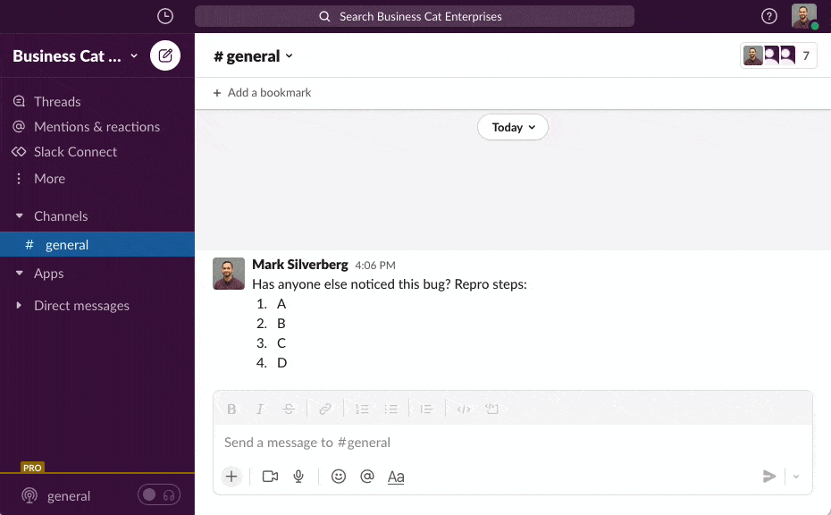
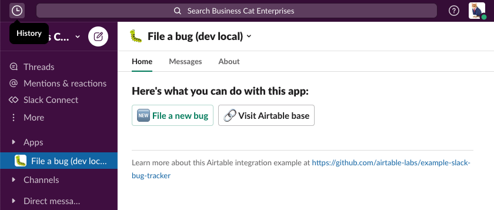
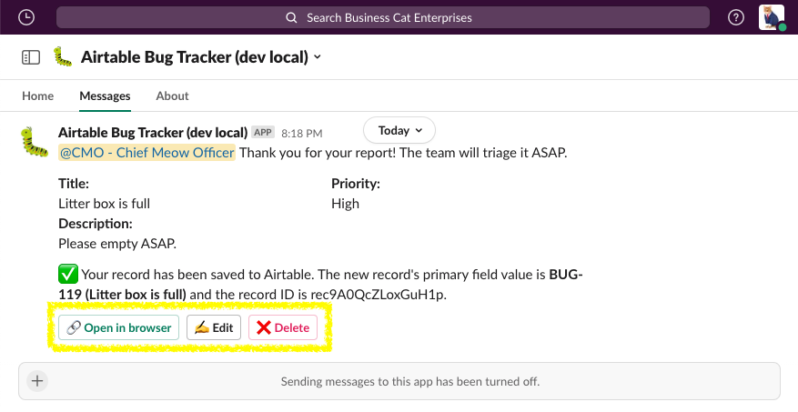

# Example Airtable+Slack App: Bug Tracker

## Overview

This is an example [Slack App](https://api.slack.com/) app built with the [Bolt for JavaScript framework](https://slack.dev/bolt-js) that has a [Global Shortcut](https://api.slack.com/interactivity/shortcuts/using#global_shortcuts) which displays a [modal](https://api.slack.com/surfaces/modals#:~:text=Modals%20provide%20focused%20spaces%20ideal,of%20any%20other%20interface%20element.) (aka form). Form submissions undergo validation and are sent to an [Airtable](https://airtable.com) base using [airtable.js](https://github.com/airtable/airtable.js) to call [Airtable's REST API](https://support.airtable.com/hc/en-us/articles/203313985-Public-REST-API).

The example code makes use of Slack [Socket Mode](https://api.slack.com/apis/connections/socket) which uses WebSockets (instead of HTTP) to receive events from Slack.

## Features & Functionality

This app has a few entry points and features to help you quickly send information to Airtable without leaving Slack:

| Name and Description 	| Visual 	|
|------------------------	|------------------------------------------------------------------------------------------------------------------------------------------------------------------------------------------------------------------------------------------------------------------------------------------------------------------------------------------------------------------------------------------------------------------------------------------------------------------------------------------------------------------	|
| **Global Shortcut** ⚡️   You can use the global shortcut :zap: to file a bug from almost anywhere in Slack.     <ol type="a"><li>Trigger the modal with a [global shortcut](https://slackhq.com/speed-up-work-with-apps-for-slack) and enter your bug report in the form</li><li>Submitted values will be validated</li><li>The bot will send you a confirmation DM and let you know if any errors occured</li></ol> 	|  |
| **Message Shortcut** 💬  You can also open the form by acting on a message using the [Message Shortcut](https://slack.com/help/articles/360004063011-Work-with-apps-in-Slack-using-shortcuts#message-shortcuts). The message you selected will be used to populate the details text area. 	|  |
| **App Home** 🏡  Visit the app's [App Home](https://api.slack.com/surfaces/tabs) for buttons to file a new bug or open the Airtable base in a browser.	|  |
| **4. Take Action** ✍️  After you create a record, you will get a DM from the app's bot user with links to open the record directly in Airtable or edit/delete the record directly from Slack. |  |

---

The software made available from this repository is not supported by Formagrid Inc (Airtable) or part of the Airtable Service. It is made available on an "as is" basis and provided without express or implied warranties of any kind.

---

## Running locally

Step-by-step instructions for setting up your Airtable base, Slack app, and to get the app up-and-running in your local development environment can be found in [`docs/LOCAL_SETUP.md`](docs/LOCAL_SETUP.md)

## See also

Additional documentation can be found in [`docs/ADDITIONAL_INFO.md`](docs/ADDITIONAL_INFO.md) including a description of each of the Slack scope required, Node packages needed to run this code, and notes on single-tenancy (current state) and OAuth.

## Contributing

New issues and PRs are encouraged!

## History/Credit
This repository began as a mirror of the [slackapi/bolt-js-getting-started-app](https://github.com/slackapi/bolt-js-getting-started-app) which can still be found on [this branch](https://github.com/airtable-labs/example-slack-bug-tracker/tree/original-from_bolt-js-getting-started-app). The blog post accompanying the original code can be found [here](https://slack.dev/bolt-js/tutorial/getting-started).
