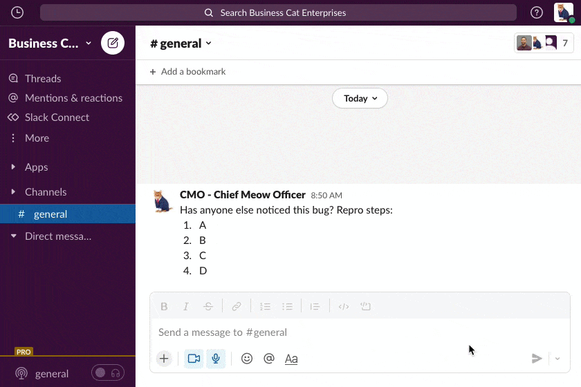

# Example Airtable+Slack App: Bug Tracker

## Overview

This is an example [Slack App](https://api.slack.com/) app built with the [Bolt for JavaScript framework](https://slack.dev/bolt-js) that has a [Global Shortcut](https://api.slack.com/interactivity/shortcuts/using#global_shortcuts) which displays a [modal](https://api.slack.com/surfaces/modals#:~:text=Modals%20provide%20focused%20spaces%20ideal,of%20any%20other%20interface%20element.) (aka form). Form submissions undergo validation and are sent to an [Airtable](https://airtable.com) base using [airtable.js](https://github.com/airtable/airtable.js) to call [Airtable's REST API](https://support.airtable.com/hc/en-us/articles/203313985-Public-REST-API).

The example code makes use of Slack [Socket Mode](https://api.slack.com/apis/connections/socket) which uses WebSockets (instead of HTTP) to receive events from Slack.

This app has a few entry points and features to help you quickly send information to Airtable without leaving Slack:

| Name and Description 	| Visual 	|
|------------------------	|------------------------------------------------------------------------------------------------------------------------------------------------------------------------------------------------------------------------------------------------------------------------------------------------------------------------------------------------------------------------------------------------------------------------------------------------------------------------------------------------------------------	|
| **1. Global Shortcut** ⚡️ <br> You can use the global shortcut :zap: to file a bug from almost anywhere in Slack.     <ol type="a"><li>Trigger the modal with a [global shortcut](https://slackhq.com/speed-up-work-with-apps-for-slack) and enter your bug report in the form</li><li>Submitted values will be validated</li><li>The bot will send you a confirmation DM and let you know if any errors occured</li></ol> 	| [](docs/global_shortcut.gif) |
| **2. Message Shortcut** 💬<br> You can also open the form by acting on a message using the [Message Shortcut](https://slack.com/help/articles/360004063011-Work-with-apps-in-Slack-using-shortcuts#message-shortcuts). The message you selected will be used to populate the details text area. 	| [](docs/message_shortcut.gif) |
| **3. App Home** 🏡<br> The app's [App Home](https://api.slack.com/surfaces/tabs) provides buttons to file a new bug or open the Airtable base in a browser window/tab.	| [](docs/app_home.png) |


## History/Credit
This repository began as a mirror of the [slackapi/bolt-js-getting-started-app](https://github.com/slackapi/bolt-js-getting-started-app) which can still be found on [this branch](https://github.com/airtable-labs/example-slack-bug-tracker/tree/original-from_bolt-js-getting-started-app). The blog post accompanying the original code can be found [here](https://slack.dev/bolt-js/tutorial/getting-started).

## Running locally

### 0. Create a new Slack App

- Go to https://api.slack.com/apps
- Click **Create App**
- Choose a workspace
- Enter App Manifest using contents of `manifest.yaml`
- Click **Create**

Once the app is created click **Install to Workspace** 
Then scroll down in Basic Info and click **Generate Token and Scopes** with both scopes

### 1. Setup environment variables

Copy `.env.example` to `.env` and paste your unique values (there are comments in the file with where to find each value)

### 2. Setup your local project

```zsh
# Clone this project onto your machine
git clone https://github.com/airtable-labs/example-slack-bug-tracker.git

# Change directory into the project
cd example-slack-bug-tracker/

# Install dependencies
npm install
```

### 3. Start the server to listen for events from Slack
```zsh
npm run start
```

### 4. Test

Your app should be ready to try from Slack 🚀. Check out the Global Shortcut ⚡️, Message Shortcut 💬, and App Home 🏡!

### 5. Iterate and develop
- You can run `npm run watch` (instead of `npm run start`) to have `nodemon` watch code files for changes and automatically restart the server for a quicker iterating.
- To change the fields in the form, update `views/modals.js` and `views/message.js` to include valid Block Kit JSON (as Node objects) and update the `app.shortcut` listeners in `app.js` to expect and use the new Slack BlockKit `block_ids` and `action_ids`

## Contributing

New issues and PRs are encouraged!